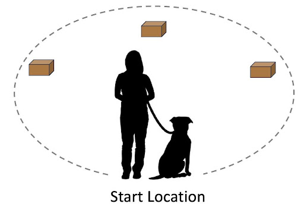
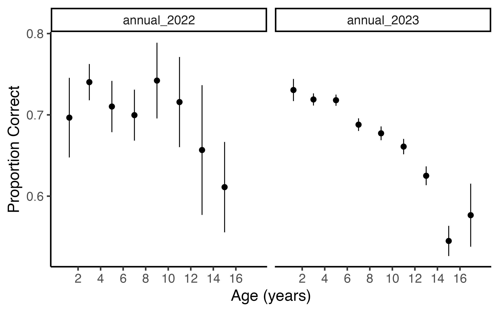

## Dog Aging Project | 1-2-3 Treat Activity User Guide

### Overview

The 1-2-3 Treat Activity is a spatial memory task that assesses a dog’s recall of the location of a food reward across a series of trials. A schematic of the task setup is provided in Figure 1 (below).  
The activity begins with a series of warm-ups in which the dog is introduced to the process of searching for treats in small boxes, positioned at three locations in an array (Figure 1). Following this warm-up, the dog participates in a series of nine trials assessing spatial memory. On each trial, the dog begins at a location equidistant from the three boxes where rewards will be placed (start location in Figure 1). The person then walks the dog along a circular path (dashed line in Figure 1) visiting each of the three boxes in sequence. Upon arrival at each box, the person visibly places a small treat into the box. At two of the three boxes, the dog is allowed to immediately consume this treat, whereas at one of the boxes, the dog observes the baiting but is prevented from consuming the treat. The dog is then returned to the start location and released to search for the sole remaining treat. The location of the first box searched is recorded on each trial as the dependent measure. The order in which the person and dog visit the boxes during the baiting process is consistent across trials, but which box contains the remaining reward is counterbalanced across trials (occurring three times at each of the three locations, following a predetermined order). 

__Figure 1. Schematic of the physical setup for the 1-2-3 Treat Activity. The dashed line indicates the path that the dog and person follow during the baiting process.__ 

### About This Document 

This document provides an introduction to the 1-2-3 Treat Activity dataset. 1-2-3 Treat Activity is an at-home cognitive assessment presented to dogs in the DAP Pack annually. Owners are guided through the 1-2-3 Treat Activity through a series of REDCap instruments (detailed below):
- 1-2-3 Treat: Introduction
- 1-2-3 Treat: Box Construction
- 1-2-3 Treat: Array Setup
- 1-2-3 Treat: Warm-Ups
- 1-2-3 Treat: Play the Game

The following data are provided to identify an instance of 1-2-3 Treat data collection.

| Variable      | Description | Example Values |
| :--- | :---------------------------- | :------------------------------- |
| `dog_id`      | Unique dog identifier       | Integer | 
| `survey_year` | Study year | annual_YYYY |
| `trt_game_date` | Date of 1-2-3 Treat: Play the Game completion | YYYY-MM-DD |

Only the last two (1-2-3 Treat: Warm-Ups and 1-2-3 Treat: Play the Game) are data collection instruments; these instruments and the resulting data are described below.

### 1-2-3 Treat: Introduction

This instrument provides an overview of 1-2-3 Treat Activity, including necessary materials and space requirements. Participants can opt-in or opt-out of the task. 

- [1-2-3 Treat: Materials List (PDF)](ReferenceFiles/Cognitive_123_Treat_Materials%20List.pdf)
- [Short overview video of 1-2-3 Treat (Vimeo)](https://vimeo.com/658661007/20a9b6fd58)

### 1-2-3 Treat: Box Construction

This instrument guides participants through the construction of 3 cardboard boxes that measure 4 x 4 x 2.5 inches. Options for appropriate alternative containers are also provided. 

- [1-2-3 Treat: Box Construction Instructions (PDF)](ReferenceFiles/Cognitive_123_Treat_Box_Construction_Instructions.pdf)
- [Box Template (PDF)](ReferenceFiles/Cognitive_123_Treat_Box_Construction_Template.pdf)
- [Box assembly with template video instructions (Vimeo)](https://vimeo.com/573250787/286af09ae4)
- [Box assembly without template video instructions (Vimeo)](https://vimeo.com/573250654/ae7cf1482d)

### 1-2-3 Treat: Array Setup

This instrument guides participants through the set up of a kite-shaped experimental array. 

- [1-2-3 Treat: Array Setup Instructions (PDF)](/ReferenceFiles/Cognitive_123_Treat_ArraySetup_Instructions.pdf)

### 1-2-3 Treat: Warm-ups

This instrument assesses the dog’s readiness for the cognitive assessment and helps the dog-owner pair become comfortable with the experimental setup. Personalized instructional videos are provided based on the owner’s decision to keep the dog on either their left or right side throughout the duration of the activity. 
 
- [1-2-3 Treat: Warm-Up Instructions & Data Sheet (PDF)](ReferenceFiles/Cognitive_123_Treat_Warm-Ups_Instructions.pdf)
- [Warm-ups video instructions - Dog on left (Vimeo)](https://vimeo.com/494159238/8c2cba1216)

The following data are collected via the 1-2-3 Treat: Warm-ups instrument:
| Variable      | Description | Example Values |
| :--- | :---------------------------- | :------------------------------- |
| `trt_warmup_handle_side`      | Side of body the dog was walked on for warm-up rounds       | 1 (Left) 2 (Right) | 
| `trt_warmup_hand_feed` | Dog response to offered treat | 1 (Enthusiastic) 2 (Reluctant) 3 (Did not eat) |
| `trt_warmup_box_feed` | Dog response to offered treat | 1 (Enthusiastic) 2 (Reluctant) 3 (Did not eat) |
| `trt_warmup_*_location` | Treat location on warmup round * | 1 (Box 1) 2 (Box 2) 3 (Box 3) |
| `trt_warmup_*_response` | Dog's response on warmup round * | 1 (My dog found food independently)   2 (I helped my dog find the food, and they ate it)   3 (I helped my dog find the food, but they didn't eat it) |
| `trt_warmup_overall_response_*` | Description of dog’s experience with warm-up activities | 0 (False) 1 (True) text |

### 1-2-3 Treat: Play the Game

This instrument guides the dog-owner pair through 9 rounds of the 1-2-3 Treat Activity and collects data on the dog’s performance. Personalized instructional videos are provided based on the owner’s decision to handle the dog on either their left or right side throughout the duration of the activity. 
 
- [1-2-3 Treat: Game Instructions & Data Sheet (PDF)](ReferenceFiles/Cognitive_123_Treat_Game_Instructions%20&%20Data%20Sheet.pdf)
- [Game video instructions - Dog on left (Vimeo)](https://vimeo.com/573249506/08a322d328)

The following data are collected via the 1-2-3 Treat: Play the Game instrument:
| Variable      | Description | Example Values |
| :--- | :---------------------------- | :------------------------------- |
| `trt_game_handle_side`      | Side of body the dog was walked on for game rounds       | 1 (Left) 2 Right) | 
| `trt_game_treat_location_round_*` | Treat location on game round * | 1 (Box 1) 2 (Box 2) 3 (Box 3) |
| `trt_game_response_round_*` | Dog's response on game round * | 1 (Searched in Box 1 first)   2 (Searched in Box 2 first)   3 (Searched in Box 3 first)   4 (Didn't search in any box)   5 (Something went wrong)   6 (My dog is not enjoying this activity, and we need to stop) |
| `trt_game_accuracy_round_*` | Accuracy of dog’s response on game round * | 0 (Incorrect) 1 (Correct) NA |
| `trt_game_overall_response` | Description of dog’s experience with game activities | 1 (Unexcited) 2 (Moderately excited)  3 (Very excited) |

### Example R code

This code provides an example of how to calculate summary scores for the Dog Aging Project 1-2-3 Treat Activity.

`# Load required packages and set a theme for the ggplot2 package:` 
`library(tidyverse)` 
`library(haven)` 
`theme_set(theme_classic(18))` 

`# Load the dog overview environment and read in the 1-2-3 Treat data:` 
`setwd(yourFilePath)` 
`load('DAP_YYYY_DogOverview_v1.0.RData')` 
`treat <- read_csv("DAP_YYYY_CognitiveGames_123Treat_v1.0.csv")` 

`# Create a smaller data frame with dog ids and estimated birth dates:` 
`ages <- select(DogOverview, dog_id, Estimated_DOB)` 

`# Convert the birth dates from character to date format:` 
`ages <- mutate(ages, dob = ymd(Estimated_DOB)) |> select(-Estimated_DOB)` 

`## Calculate a summary score for the 123 Treat activity` 

`# Select columns containing the accuracy of dogs’ choices and restructure the data into a long format:` 
`treat_long <- select(treat, dog_id, contains('accuracy')) |> 
  pivot_longer(cols = contains('accuracy'), names_to = 'trial', values_to = 'accuracy')` 

`# Remove the leading text from the trial numbers and convert them to numeric values:` 
`treat_long <- mutate(treat_long, trial = as.numeric(str_remove(trial, 'trt_game_accuracy_round_')))` 

`# Join the age and 123 Treat datasets:` 
`dat <- left_join(treat_long, ages)` 

`# Estimate dog ages at the time they completed 123 Treat:` 
`dat <- mutate(dat, age_years = time_length(difftime(trt_game_date, dob),"years"))` 

`# Remove trials on which the dog did not choose one of the boxes (NA):` 
`dat <- filter(dat, !is.na(accuracy))` 

`# Calculate overall proportion correct for each dog:` 
`smry <- dat |> group_by(dog_id, age_years) |> summarise(prop_correct = mean(accuracy), n = n())` 

`# Remove cases in which fewer than 5 trials were recorded since these may not contain enough information to confidently compute an overall score:` 
`smry <- filter(smry, n > 4)` 

`## Data visualization` 
`# Does overall performance vary by age?:` 
`my_breaks <- c(0,2,4,6,8,10,12,14,16,20)` 
`ggplot(filter(smry, age_years < 18), aes(x = age_years, y = prop_correct)) + 
  stat_summary() +
  scale_x_binned(breaks = my_breaks) +
  labs(x = "Age (years)", y = "Proportion Correct") +
  facet_grid(~survey_year)`

*** 

###### *last updated 2024-01-26*